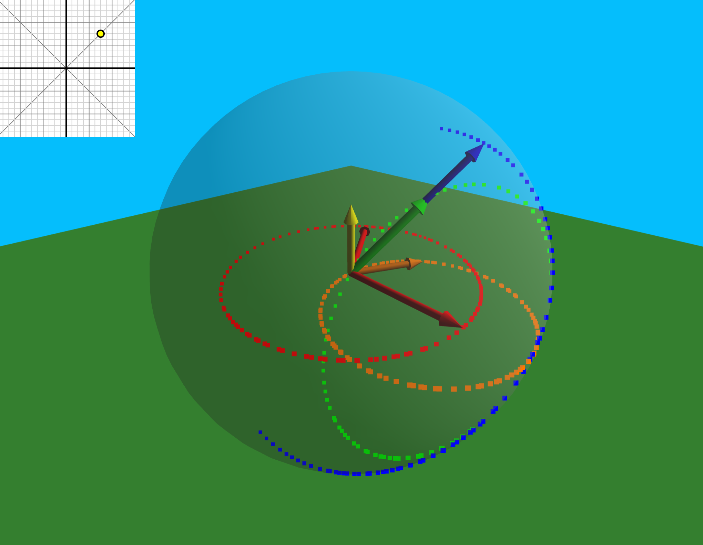

# 3d-rotation-composition
Visualising how 3D rotations compose -- as VECTORS, not inscrutable matrices or quaternions.

Inspired and greatly aided by the treatment in the *first* edition of *Structure And Interpretation Of Classical Mechanics* (rigid body chapter).

**Definition**: A **mod-axis** (modulated axis) is a unit rotation axis scaled by the sine of half its rotation angle.

Sine itself inverts to 2 angle values, but sine-half is actually **bijective**. Thus one key fact is that for every mod-axis there is a single corresponding rotation, and for every 3D rotation there is one single, canonical mod-axis.

Without loss of generality, 3D rotation composition depends on only three parameters: the angle between the rotation axes, and the two angles around each axis. Each combination thereof reduces to a single 3D rotation about a composite angle and axis.

Thus there is some sort of 3D scalar field where the temperature at each point represents the composite angle, as well as a 3D vector field with the composite axis interpreted as wind direction.

This project aims to explore and visualise this space in a manner inspired by one of Bret Victor's essays. I even hope that some basic rules or patterns can be discovered and aid with 3D graphics programming once memorised.

Currently, the graph at the top-left is the space of possible rotation angle pairs, with A horizontal and B vertical, both between -180 and +180 degrees. Clicking on an intersection of gridlines (15 degrees apart) will visualise via these angles, changing the final parameter (inter-axis angle) cyclically over time and tracing out the paths of the vectors.

Key:
* The **red** circle is the path traced by the second mod-axis (`axis_b`) as it itself rotates. Thus the angle between `axis_b` and the fixed `axis_a` (also red) is changing over time.
* The **orange** vector is roughly the "a plus b" vector (`a_p_b`). *(Actually, it is cos-half-angle-b times `axis_a` + cos-half-angle-a times `axis_b`)*
* The **yellow** vector is the cross of the two mod-axes a and b.
* The **blue** vector is the **composite axis** (a followed by b); it is the *normalisation* of the green vector.
* The **green** vector is the **composite mod-axis.**
